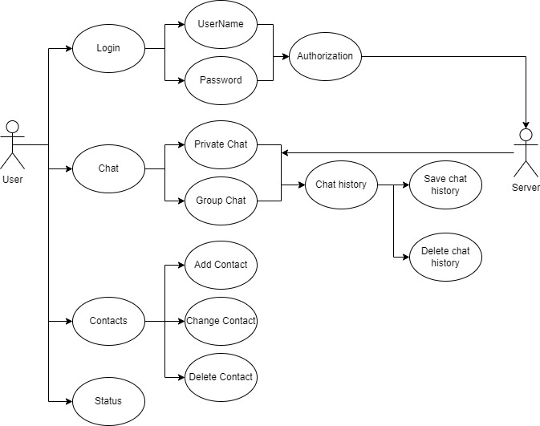
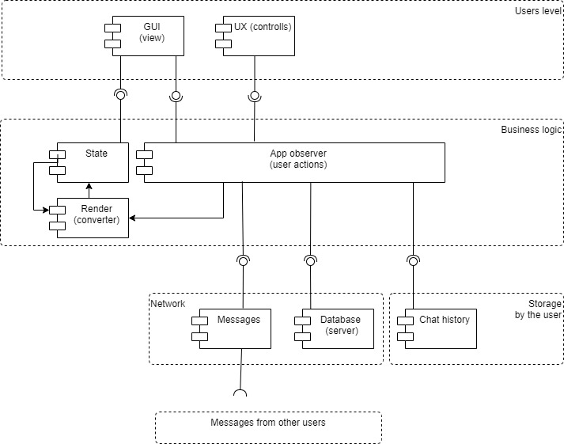
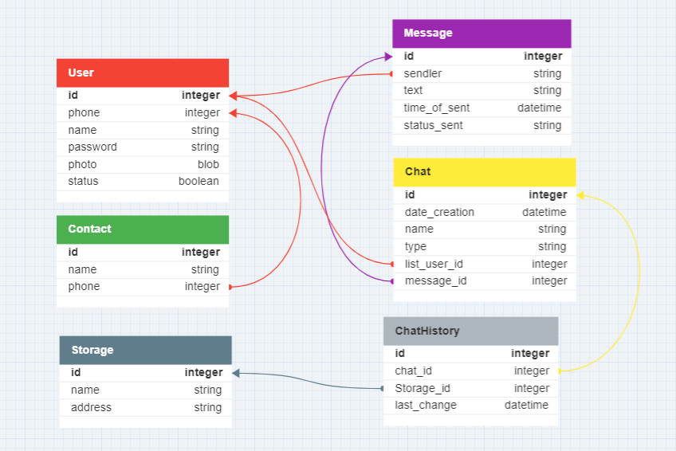
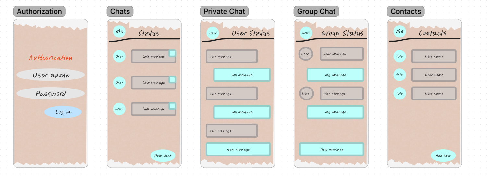

# Урок 10. Структура приложения с пользовательским интерфейсом и базой данных (паттерн Repository)

## Разработать приложение мессенджера (на выбор desktop/web/mobile). 

### Требуется: 
* Написать use case диаграмму.
* Выбрать архитектуру для приложения (кратко обосновать выбор).
* Разработать UML диаграмму.
* Разработать ER диаграмму.
* Используя метод персон (не менее 3), описать каких функций не хватает.
* Пересмотреть UML и ER диаграммы с учетом недостатков. 
* Создать интерфейс в figma для приложения.

### Инструменты:

https://www.figma.com/
https://app.diagrams.net/
https://www.dbdesigner.net/
https://swagger.io

#### use case диаграмма:

#### Архитектура для приложения:
Была выбрана архитектура MVI, как идеальный вариант для нативного использования приложения
и асинхронного потока данных.

#### UML:

#### ERD:

#### Interface:

#### Метод персон:
В данном варианте чата, пользователь не сможет отправлять фото, видео или аудио файлы.
Со временем приложение будет доработано.